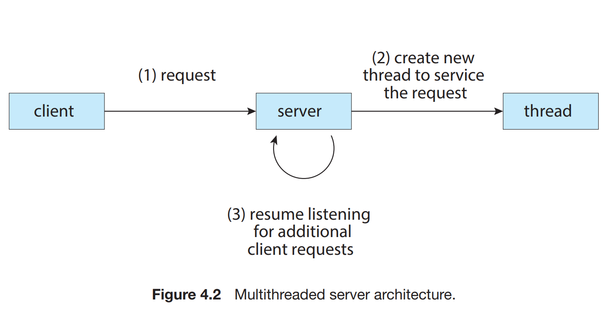

# Threads and Concurrency

## NOTES

- all modern operating systems provide features enabling a process to contain multiple
  threads of control. Identifying opportunities for parallelism through the use of
  threads is becoming increasingly important for modern multicore systems that
  provide multiple CPUs.

- A thread is a basic unit of CPU utilization; it comprises a thread ID, a program
  counter (PC), a register set, and a stack. It shares with other threads belonging
  to the same process its code section, data section, and other operating-system
  resources.

- If a process has multiple threads of control, it can perform
  more than one task at a time.

- A busy web server may have several clients concurrently accessing it. If the web server ran as a
  traditional single-threaded process, it would be able to service only one client
  at a time, and a client might have to wait a very long time for its request to be
  serviced.

- One solution is to have the server run as a single process that accepts
  requests. When the server receives a request, it creates a separate process
  to service that request. In fact, this process-creation method was in common
  use before threads became popular.

- It is generally more efficient to use one process that contains multiple threads. If the web-server process is
  multithreaded, the server will create a separate thread that listens for client
  requests.

- the benifits of multithreading

  1. Responsiveness. Multithreading an interactive application may allow a
     program to continue running even if part of it is blocked or is performing a lengthy operation.
  2. Resource sharing, threads share the memory and the resources of the process to which they belong by default.
  3. Economy. Allocating memory and resources for process creation is costly.
  4. Scalability. The benefits of multithreading can be even greater in a multiprocessor architecture, where threads may be running in parallel on different processing cores.

- A concurrent system supports more than one task by allowing all the tasks
  to make progress. In contrast, a parallel system can perform more than one task
  simultaneously. Thus, it is possible to have concurrency without parallelism.

- In general, there are two types of parallelism: data parallelism and task parallelism.

  - Data parallelism focuses on distributing data across multiple computing cores.
  - Task parallelism involves distributing tasks (threads) across multiple computing cores.

- support for threads may be provided either at the user level, for user threads, or by the
  kernel, for kernel threads. User threads are supported above the kernel and
  are managed without kernel support, whereas kernel threads are supported
  and managed directly by the operating system.

- a relationship must exist between user threads and kernel threads.

  1. Many-to-One Model. maps many user-level threads to one kernel thread. Thread management is done by the thread library in user space,so it is efficient, However, the entire process will block if a thread makes a blocking system call.
  2. One-to-One Model. maps each user thread to a kernel thread. It provides more concurrency than the many-to-one model by allowing another thread to run when a thread makes a blocking system call. the only drawback of it is that, a large number of kernel threads may burden the performance of a system.
  3. The many-to-many model. multiplexes many user-level threads to a smaller or equal number of kernel threads.

- Whereas the manyto-one model allows the developer to create as many user threads as she
  wishes, it does not result in parallelism, because the kernel can schedule only
  one kernel thread at a time. The one-to-one model allows greater concurrency,
  but the developer has to be careful not to create too many threads within an
  application. The many-to-many model suffers from neither of these
  shortcomings: developers can create as many user threads as necessary, and
  the corresponding kernel threads can run in parallel on a multiprocessor.

- One way to address difficulties of creating threads is to transfer the creation and management of threading from application developers to compilers and run-time libraries.
  This strategy, termed implicit threading, these strategies generally require application developers to
  identify tasks—not threads—that can run in parallel.

- why thread pool.

  - Servicing a request with an existing thread is often faster than waiting to
    create a thread.
  - A thread pool limits the number of threads that exist at any one point.

- The general idea behind a thread pool is to create a number of threads at
  start-up and place them into a pool, where they sit and wait for work. When a
  server receives a request, rather than creating a thread, it instead submits the
  request to the thread pool and resumes waiting for additional requests.
  If the pool contains no available thread, the task is queued until
  one becomes free. Once a thread completes its service, it returns to the pool
  and awaits more work.

- fork-join model. the main parent thread creates (forks) one or more child threads and then waits for the children to terminate and join with it, at which point it can retrieve and combine their results.

## SUMMARY

- A thread represents a basic unit of CPU utilization, and threads belonging
  to the same process share many of the process resources, including code and data.
- There are four primary benefits to multithreaded applications: (1) responsiveness, (2) resource sharing, (3) economy, and (4) scalability.
- Concurrency exists when multiple threads are making progress, whereas
  parallelism exists when multiple threads are making progress simultaneously. On a system with a single CPU, only concurrency is possible; parallelism requires a multicore system that provides multiple CPUs.

- There are several challenges in designing multithreaded applications.
  They include dividing and balancing the work, dividing the data between the different threads, and identifying any data dependencies. Finally, multithreaded programs are especially challenging to test and debug.

- Data parallelism distributes subsets of the same data across different computing cores and performs the same operation on each core. Task parallelism distributes not data but tasks across multiple cores. Each task is
  running a unique operation.

- User applications create user-level threads, which must ultimately be
  mapped to kernel threads to execute on a CPU. The many-to-one model
  maps many user-level threads to one kernel thread. Other approaches
  include the one-to-one and many-to-many models.

- A thread library provides an API for creating and managing threads. Three
  common thread libraries include Windows, Pthreads, and Java threading.
  Windows is for the Windows system only, while Pthreads is available for
  POSIX-compatible systems such as UNIX, Linux, and macOS. Java threads
  will run on any system that supports a Java virtual machine.

- Implicit threading involves identifying tasks—not threads—and allowing
  languages or API frameworks to create and manage threads. There are
  several approaches to implicit threading, including thread pools, fork-join
  frameworks, and Grand Central Dispatch. Implicit threading is becoming
  an increasingly common technique for programmers to use in developing
  concurrent and parallel applications.

- Threads may be terminated using either asynchronous or deferred cancellation. Asynchronous cancellation stops a thread immediately, even if it
  is in the middle of performing an update. Deferred cancellation informs
  a thread that it should terminate but allows the thread to terminate in an
  orderly fashion. In most circumstances, deferred cancellation is preferred
  to asynchronous termination.

- Unlike many other operating systems, Linux does not distinguish between
  processes and threads; instead, it refers to each as a task. The Linux
  clone() system call can be used to create tasks that behave either more
  like processes or more like threads.

## Practice Exercises

- Provide three programming examples in which multithreading providesbetter performance than a single-threaded solution?
    - A web server that services each request in a separate thread
    - A parallelized application such as matrix multiplication wherevarious parts of the matrix can be worked on in parallel
    - An interactive GUI program such as a debugger where one thread isused to monitor user input, another thread represents the runningapplication, and a third thread monitors performance

- Does the multithreaded web server described in exhibit taskor data parallelism?
    - Data parallelism. Each thread is performing the same task, but on differ-ent data.
- What are two differences between user-level threads and kernel-levelthreads?
    - User-level threads are unknown by the kernel, whereas the kernelis aware of kernel threads
- Describe the actions taken by a kernel to context-switch between kernel-level threads?
    - Context switching between kernel threads typically requires saving thevalue of the CPU registers from the thread being switched out and restor-ing the CPU registers of the new thread being scheduled.
- What resources are used when a thread is created? How do they differfrom those used when a process is created?
    - Because a thread is smaller than a process, thread creation typically uses fewer resources than process creation. Creating a process requires allocating a process control block (PCB), a rather large data structure.The PCB includes a memory map, a list of open files, and environmentvariables. Allocating and managing the memory map is typically the most time-consuming activity. Creating a thread involves allocating a small data structure to hold a register set,stack, and priority.
