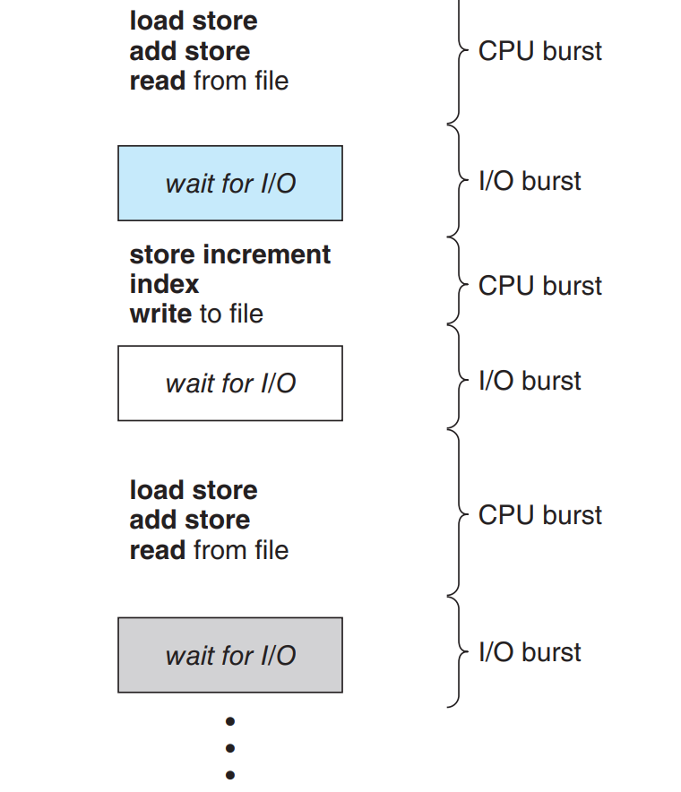
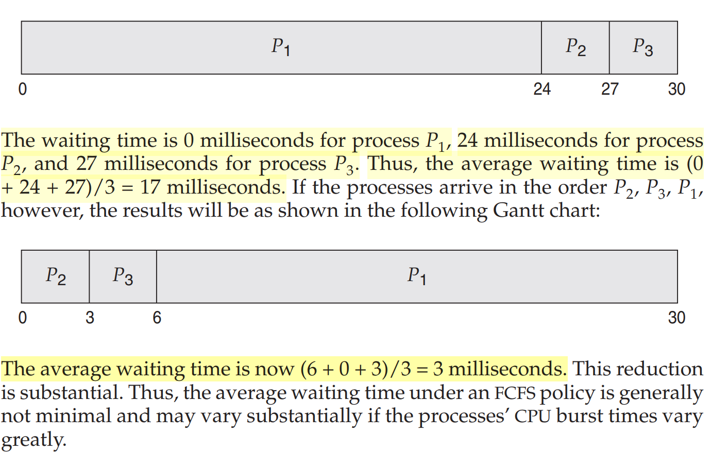
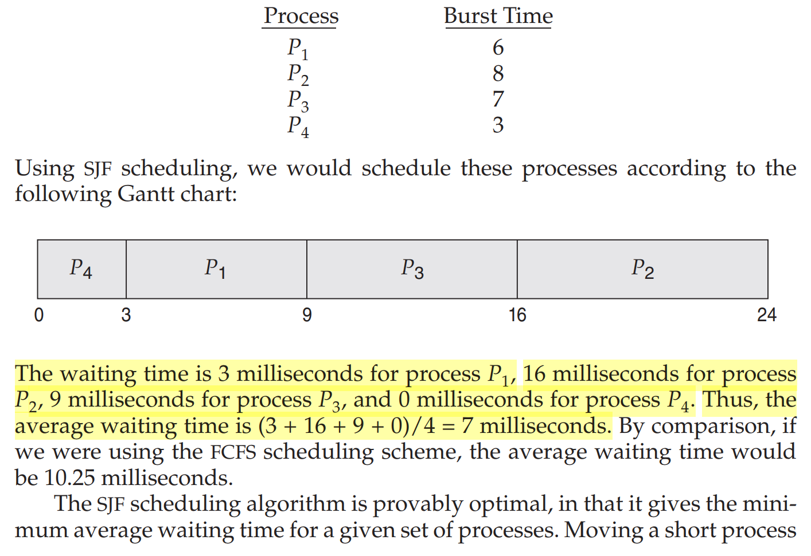
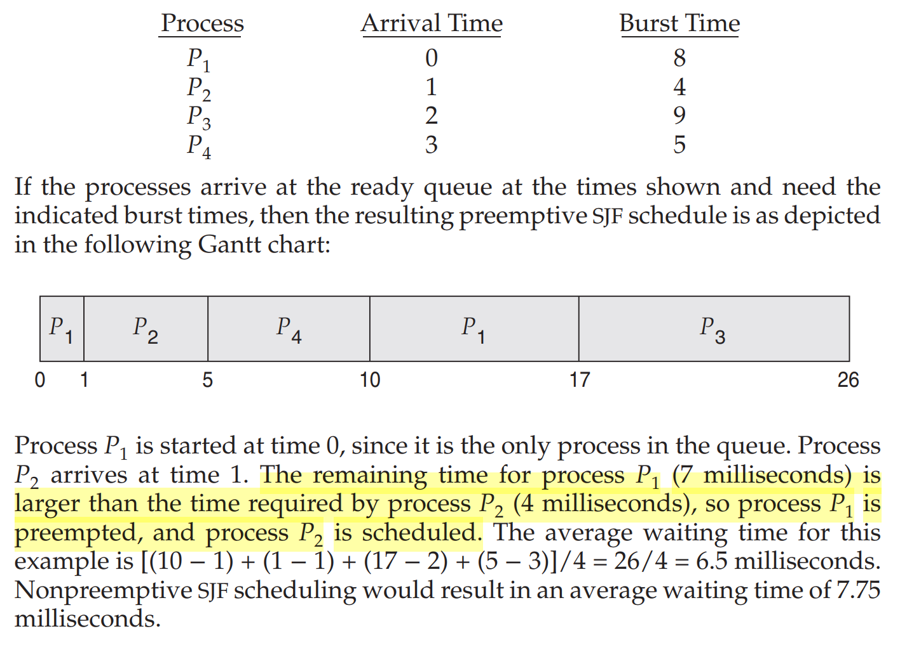
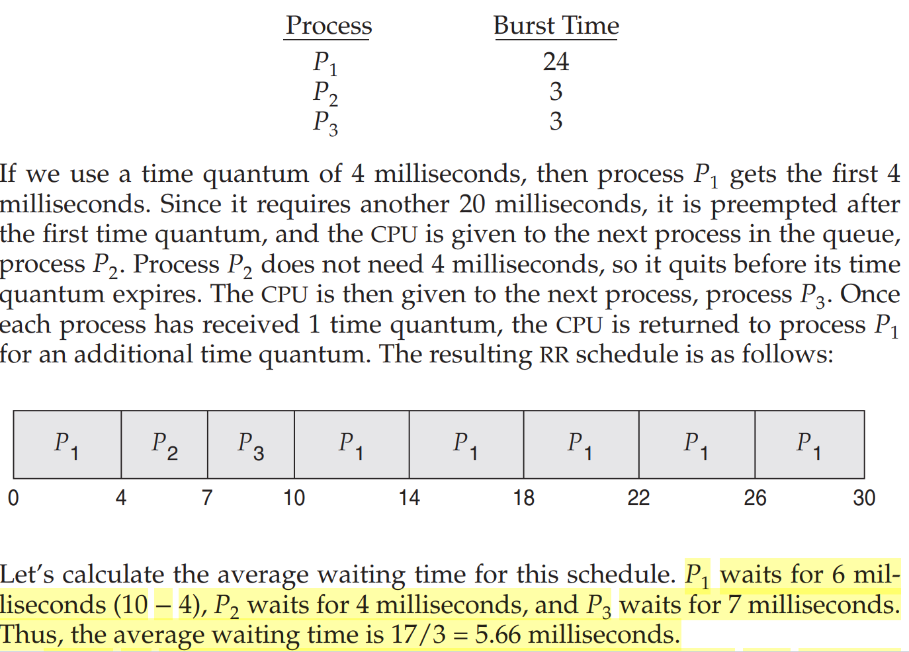
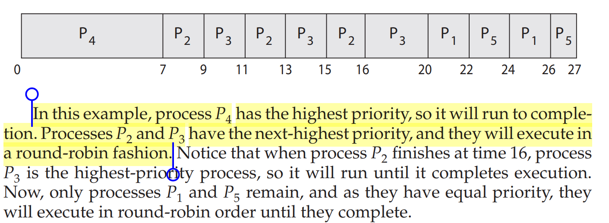

# 5.CPU Scheduling.

## NOTES

- A process is executed until it must wait, typically for the completion of some I/O request. In a simple computer
  system, the CPU then just sits idle. All this waiting time is wasted; no useful
  work is accomplished. With multiprogramming, we try to use this time productively. Several processes are kept in memory at one time. When one process has
  to wait, the operating system takes the CPU away from that process and gives
  the CPU to another process.

- process execution consists of a cycle of CPU execution and I/O wait. Processes
  alternate between these two states. Process execution begins with a CPU burst.
  That is followed by an I/O burst, which is followed by another CPU burst, then
  another I/O burst, and so on. Eventually, the final CPU burst ends with a system
  request to terminate execution.
  

- Whenever the CPU becomes idle, the operating system must select one of the
  processes in the ready queue to be executed. The selection process is carried out
  by the CPU scheduler, which selects a process from the processes in memory
  that are ready to execute and allocates the CPU to that process.

- CPU-scheduling decisions may take place under the four circumstances:

  1. When a process switches from the running state to the waiting state.
  2. When a process switches from the running state to the ready state.
  3. When a process switches from the waiting state to the ready state.
  4. When a process terminates

- When scheduling takes place only under circumstances 1 and 4, we say that
  the scheduling scheme is nonpreemptive. Otherwise, it is preemptive.

- The dispatcher is the module that gives control of the CPU’s core to the process
  selected by the CPU scheduler.

  - Switching context from one process to another
  - Switching to user mode
  - Jumping to the proper location in the user program to resume that program

- The dispatcher should be as fast as possible, since it is invoked during every
  context switch. The time it takes for the dispatcher to stop one process and start
  another running is known as the dispatch latency.

- Many criteria have been suggested for comparing CPU-scheduling algorithms.

  - CPU utilization. We want to keep the CPU as busy as possible.
  - Throughput. the number of processes that are completed per time unit, called throughput.
  - turnaround time. The interval from the time of submission of a process to the time of completion.
  - Waiting time. the sum of the periods spent waiting in the ready queue.
  - response time. the time from the submission of a request until the first response is produced.

- It is desirable to maximize CPU utilization and throughput and to minimize
  turnaround time, waiting time, and response time.

- CPU scheduling deals with the problem of deciding which of the processes in
  the ready queue is to be allocated the CPU’s core.

- first-come first-serve (FCFS) scheduling algorithm. With this scheme, the process that requests the
  CPU first is allocated the CPU first.

  - the average waiting time under the FCFS policy is
    often quite long.
  - 
  - FCFS scheduling algorithm is nonpreemptive. Once the CPU has been allocated to a process, that process keeps the CPU until it releases the CPU.

- the shortest-job-first (SJF) scheduling algorithm. This algorithm associates with each process the length of the
  process’s next CPU burst. When the CPU is available, it is assigned to the process
  that has the smallest next CPU burst.

  - 
  - Although the SJF algorithm is optimal, it cannot be implemented at the level
    of CPU scheduling, as there is no way to know the length of the next CPU burst.
    One approach to this problem is to try to approximate SJF scheduling. We may
    not know the length of the next CPU burst, but we may be able to predict its
    value. We expect that the next CPU burst will be similar in length to the previous
    ones.
  - The SJF algorithm can be either preemptive or nonpreemptive.

  - Preemptive SJF scheduling is sometimes called shortest-remainingtime-first scheduling
    - 

- The round-robin (RR) scheduling algorithm is similar to FCFS scheduling, but preemption is added to enable the system to switch between processes.

  - The ready queue is treated as
    a circular queue. The CPU scheduler goes around the ready queue, allocating
    the CPU to each process for a time interval of up to 1 time quantum.
  - In the RR scheduling algorithm, no process is allocated the CPU for more
    than 1 time quantum in a row (unless it is the only runnable process). If a
    process’s CPU burst exceeds 1 time quantum, that process is preempted and is
    put back in the ready queue.
  - 

- An SJF algorithm is simply a priority algorithm where the priority.
  The larger the CPU burst, the lower the priority, and vice versa.

- Priority scheduling can be either preemptive or nonpreemptive. When a
  process arrives at the ready queue, its priority is compared with the priority of
  the currently running process. Apreemptive priority scheduling algorithm will
  preempt the CPU if the priority of the newly arrived process is higher than the
  priority of the currently running process. A nonpreemptive priority scheduling
  algorithm will simply put the new process at the head of the ready queue.

- indefinit blocking, or starvation. A process that is ready to run but waiting for the CPU can
  be considered blocked. A priority scheduling algorithm can leave some low priority processes waiting indefinitely. In a heavily loaded computer system, a stream of higher-priority processes can prevent a low-priority process
  from ever getting the CPU.

- A solution to the problem of indefinite blockage of low-priority processes is
  aging. Aging involves gradually increasing the priority of processes that wait
  in the system for a long time.

- Another option is to combine round-robin and priority scheduling in such
  a way that the system executes the highest-priority process and runs processes
  with the same priority using round-robin scheduling.

  - 

- With both priority and round-robin scheduling, all processes may be placed
  in a single queue, and the scheduler then selects the process with the highest
  priority to run. Depending on how the queues are managed, an O(n) search
  may be necessary to determine the highest-priority process. In practice, it is
  often easier to have separate queues for each distinct priority.
  This approach—known as multilevel queue.

## SUMMARY

- CPU scheduling is the task of selecting a waiting process from the ready
  queue and allocating the CPU to it. The CPU is allocated to the selected
  process by the dispatcher.
- Scheduling algorithms may be either preemptive (where the CPU can be
  taken away from a process) or nonpreemptive (where a process must
  voluntarily relinquish control of the CPU). Almost all modern operating
  systems are preemptive.
- Scheduling algorithms can be evaluated according to the following five
  criteria: (1) CPU utilization, (2) throughput, (3) turnaround time, (4) waiting
  time, and (5) response time.
- First-come, first-served (FCFS) scheduling is the simplest scheduling algorithm, but it can cause short processes to wait for very long processes.
- Shortest-job-first (SJF) scheduling is provably optimal, providing the shortest average waiting time. Implementing SJF scheduling is difficult, however, because predicting the length of the next CPU burst is difficult.
- Round-robin (RR) scheduling allocates the CPU to each process for a time
  quantum. If the process does not relinquish the CPU before its time quantum expires, the process is preempted, and another process is scheduled
  to run for a time quantum

- Priority scheduling assigns each process a priority, and the CPU is allocated
  to the process with the highest priority. Processes with the same priority
  can be scheduled in FCFS order or using RR scheduling.

- Multilevel queue scheduling partitions processes into several separate
  queues arranged by priority, and the scheduler executes the processes in
  the highest-priority queue. Different scheduling algorithms may be used in each queue.

- Multilevel feedback queues are similar to multilevel queues, except that a
  process may migrate between different queues.

## Practice Exercises

- Explain the difference between preemptive and nonpreemptive schedul-ing?
  - Preemptive scheduling allows a process to be interrupted in the midst ofits execution, taking the CPU away and allocating it to another process.Nonpreemptive scheduling ensures that a process leave the CPU only when it finishes with its current CPU burst.
