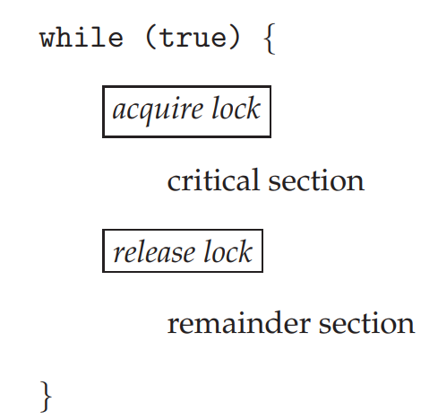
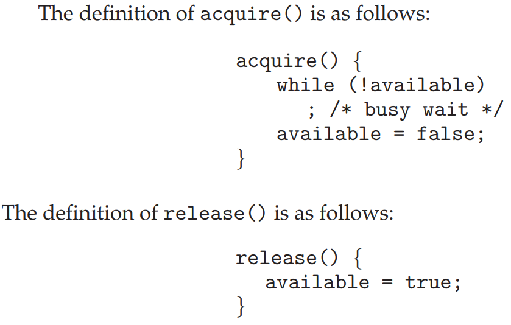
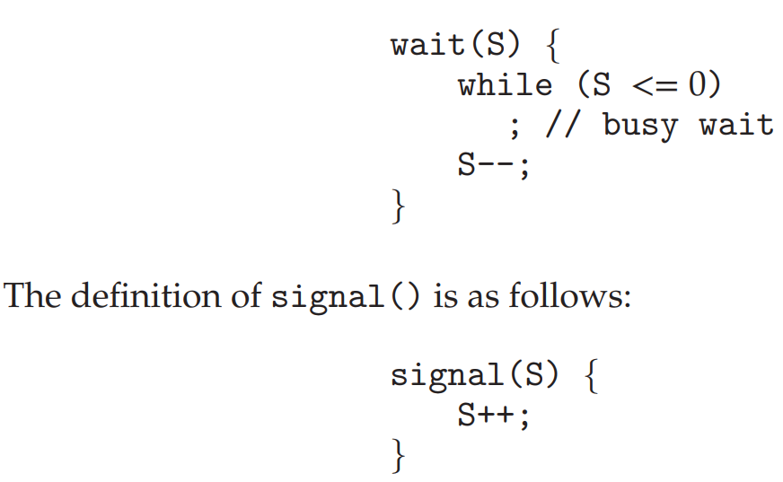
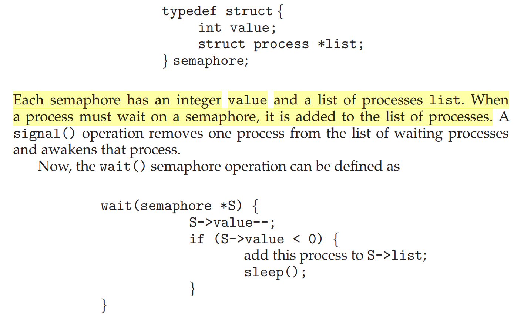

# Synchronization Tool

## NOTES

- A cooperating process can affect or be affected by other processes
  executing in the system. Cooperating processes can either directly share a logical address space or be allowed to share data
  only through shared memory or message passing. Concurrent access to shared data may result in data inconsistency.

- concurrent or parallel execution can contribute to issues involving the integrity of data shared by several processes.

- Process synchronization is very helpful when multiple processes are running at the same time and more than one process has access to the same data at the same time.

- where several processes access and manipulate the same data concurrently and the outcome of the execution depends on the particular order in which the access takes place, is called a `race condition`.

- To guard against the race condition, we need to ensure that only one process at a time can manipulate the same variable. To make such a guarantee, we require that the processes be synchronized in some way.

- Consider a system consisting of n processes. Each process has a segment of code, called a critical section,
  in which the process may be accessing — and updating — data that is shared with at least one other process. When one process is executing in its critical section, no other process is allowed to execute in its critical section. That is, no two processes are executing in their critical sections at the same time.

- `The critical section` refers to the segment of code where processes access shared resources, such as common variables and files, and perform write operations on them.

- `The critical-section problem` is to design a protocol that the processes can use to synchronize their activity to cooperatively share data. Each process must request permission to enter its
  critical section.

- The section of code implementing this request is the entry section. The critical section may be followed by an exit section. The remaining code is the remainder section.

- A solution to the critical-section problem must satisfy the following three requirements:

  - `Mutual exclusion`. If process Pi is executing in its critical section, then no other processes can be executing in their critical sections.

  - `Progress.` When no process is executing in its critical section, and there exists a process that wishes to enter its critical section, it should not have to wait indefinitely to enter it.
  - `Bounded waiting`. There must be a bound on the number of times a process is allowed to execute in its critical section.

- The critical-section problem could be solved simply in a single-core environment if we could prevent interrupts from occurring while a shared variable was being modified.

- operating-system designers build higher-level software
  tools to solve the critical-section problem. The simplest of these tools is the `mutex lock`. We use the mutex lock to protect critical sections and thus prevent race conditions.

  - That is, a process must acquire the lock before entering a critical section; it releases the lock when it exits the critical section. The `acquire()`function acquires the lock, and the `release()` function releases the lock.
  - A mutex lock has a boolean variable `available` whose value indicates if the lock is available or not. If the lock is available, a call to `acquire()` succeeds, and the lock is then considered unavailable. A process that attempts to acquire
    an unavailable lock is blocked until the lock is released.
  -  
    
  - The main disadvantage of it is that it requires
    `busy waiting`. While a process is in its critical section, any other process that tries to enter its critical section must loop continuously in the call to acquire().
  - this type of mutex lock is called a `spinlock` because the process “spins” while waiting for the lock to become available.

- Another solution to the critical section problem is `Semaphores`:

  - A `semaphore` S is an integer variable that, is accessed only through two standard atomic operations: wait() and signal().
  - 
  - The semaphore is initialized to the number of resources available. Each process that wishes to use a resource performs a `wait()` operation on the semaphore `(thereby decrementing the
count)`. When a process releases a resource, it performs a `signal()` operation `(incrementing the count)`. When the count for the semaphore goes to 0, all resources are being used. After that, processes that wish to use a resource will be blocked until the count becomes greater than 0.
  - Semaphores has overcome the problem of busy waiting by:
    - When a process executes the wait() operation and finds that the
      semaphore value is not positive, rather than `busy waiting`, the process can suspend itself. The suspend operation places a process into a waiting queue associated with the semaphore, and the state of the process is switched to the waiting state.
    - 

- One consequence of using synchronization tools is the possibility that a process attempting to enter its critical section will wait indefinitely.
- Liveness refers to a set of properties that a system must satisfy to ensure that processes make progress during their execution life cycle.
- The implementation of a semaphore with a waiting queue may result in a situation where two or more processes are waiting indefinitely for an event that can be caused only by one of the waiting processes. The event in question is the execution of a signal() operation. When such a state is reached, these processes are said to be `deadlocked`.

## SUMMARY
- A race condition occurs when processes have concurrent access to shared
data and the final result depends on the particular order in which concurrent accesses occur. Race conditions can result in corrupted values of
shared data.
- A critical section is a section of code where shared data may be manipulated and a possible race condition may occur. The critical-section problem is to design a protocol whereby processes can synchronize their activity to
cooperatively share data.
- A solution to the critical-section problem must satisfy the following three requirements: (1) mutual exclusion, (2) progress, and (3) bounded waiting.
- Mutual exclusion ensures that only one process at a time is active in its critical section. Progress ensures that programs will cooperatively determine
what process will next enter its critical section. Bounded waiting limits
how much time a program will wait before it can enter its critical section.
- Software solutions to the critical-section problem, such as Peterson’s solution, do not work well on modern computer architectures.
- Hardware support for the critical-section problem includes memory barriers; hardware instructions, such as the compare-and-swap instruction; and atomic variables.
- A mutex lock provides mutual exclusion by requiring that a process
acquire a lock before entering a critical section and release the lock on exiting the critical section.
- Semaphores, like mutex locks, can be used to provide mutual exclusion. However, whereas a mutex lock has a binary value that indicates if the lock is available or not, a semaphore has an integer value and can therefore be used to solve a variety of synchronization problems.
- A monitor is an abstract data type that provides a high-level form of process synchronization. A monitor uses condition variables that allow processes to wait for certain conditions to become true and to signal one another when conditions have been set to true.
- Solutions to the critical-section problem may suffer from liveness problems, including deadlock.
- The various tools that can be used to solve the critical-section problem as well as to synchronize the activity of processes can be evaluated under varying levels of contention. Some tools work better under certain contention loads than others.