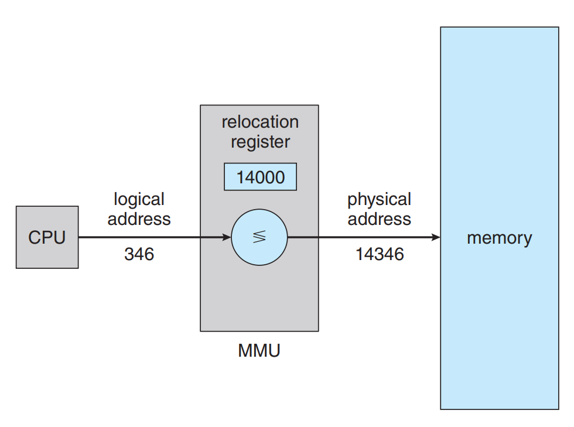

# 9.Main Memory

## NOTES

### Background

- Memory consists of a large array of bytes, each with its own address.
  The CPU fetches instructions from memory according to the value of the program counter.
  These instructions may cause loading from and storing to specific memory addresses.

- A typical instruction-execution cycle, for example, first fetches an instruction from memory.
  The instruction is then decoded and may cause operands to be fetched from memory.
  After the instruction has been executed on the operands, results may be stored back in memory.

- Main memory and the registers are the only storage that the CPU can access directly.
  There are machine instructions that take memory addresses as arguments, but none that take disk addresses.
  If the data are not in memory, they must be moved there before the CPU can operate on them.

- For proper system operation, we must protect the operating system from access by user processes, as well as protect user processes from one another. This protection must be provided by the hardware.

  - We first need to make sure that each process has a separate memory space.
  - We can provide this protection by using two registers, usually a base and a limit.
    The base register holds the smallest legal physical memory address; the limit register specifies the size of the range.
  - 
  - if the base register holds `300040` and the limit register is `120900`,
    then the program can legally access all addresses from 300040 through 420939.
  - Protection of memory space is accomplished by having the CPU hardware compare every address generated in user mode with the registers. Any attempt by a program executing in user mode to access operating-system memory or other users’ memory results in a trap to the operating system, which treats the attempt as a fatal error.
  - The base and limit registers can be loaded only by the operating system, which uses a special privileged instruction. only the operating system can load the base and limit registers.
    This allows the operating system to change the value of the registers but prevents user programs from changing the registers’ contents.
  - The operating system, executing in kernel mode, is given unrestricted access to both operating-system memory and users’ memory. This provision allows the operating system to load users’ programs into users’ memory, to
    dump out those programs in case of errors, to access and modify parameters
    of system calls, to perform I/O to and from user memory, and to provide
    many other services.

- Usually, a program resides on a disk as a binary executable file. To run, the program must be brought into memory and placed within the context of a process.

- The program goes through several steps before being executed:

  - Addresses may be represented in different ways during these steps.
    Addresses in the source program are generally `symbolic (such as the variable count)`. A compiler typically binds
    these symbolic addresses to `relocatable addresses (such as “14 bytes from the beginning of this module”)`. The linker or loader in turn binds the relocatable addresses to `absolute addresses (such as 74014)`. Each binding is a mapping from one address space to another.
    - 

- An address generated by the CPU is commonly referred to as a logical address,
  whereas an address seen by the memory unit—that is, the one loaded into the memory-address register of the memory—is commonly referred to as a physical address.
- The run-time mapping from virtual to physical addresses is done by a hardware device called the `memory-management unit (MMU)`.
- `The base register is now called a relocation register`. The value in the relocation register is added to every
  address generated by a user process at the time the address is sent to memory. For example, if the base is at 14000, then an attempt by the user to address location 0 is dynamically relocated to location 14000; an access to location 346 is mapped to location 14346.
- We now have two different types of addresses: logical addresses `(in the range 0 to max)` and physical addresses
  `(in the range R + 0 to R + max for a base value R)`. The user program generates only logical addresses and thinks that
  the process runs in memory locations from 0 to max. However, `these logical addresses must be mapped to physical addresses before they are used. `
- 

- he size of a process has thus been limited to the size of physical memory. To obtain
  better memory-space utilization, we can use `dynamic loading`.
  - With dynamic loading, a routine is not loaded until it is called. All routines are kept on disk
    in a relocatable load format. The main program is loaded into memory and is executed. When a routine needs to call another routine, the calling routine first checks to see whether the other routine has been loaded. If it has not, the relocatable linking loader is called to load the desired routine into memory and
    to update the program’s address tables to reflect this change.
  - The advantage of dynamic loading is that a routine is loaded only when it is needed. This method is particularly useful when large amounts of code are needed to handle infrequently occurring cases.

### Contiguous Memory Allocation

- The main memory must accommodate both the operating system and the user processes.
  We therefore need to allocate main memory in the most efficient way possible.
- The memory is usually divided into two partitions: one for the operating
  system and one for the user processes.
- In contiguous memory allocation, all the processes are contiguous for each other.
- One of the simplest methods of allocating memory is to assign processes to variably sized partitions in memory, where each partition may contain exactly one process. In this variable partition scheme, the operating system keeps a table indicating which parts of memory are available and which are occupied.
- What happens when there isn’t sufficient memory to satisfy the demands
  of an arriving process? One option is to simply reject the process and provide
  an appropriate error message. Alternatively, we can place such processes into
  a wait queue. When memory is later released, the operating system checks the
  wait queue to determine if it will satisfy the memory demands of a waiting process.
- When a process arrives and needs memory, the system searches the set for a hole that is large enough
  for this process. If the hole is too large, it is split into two parts. One part is
  allocated to the arriving process; the other is returned to the set of holes. When
  a process terminates, it releases its block of memory, which is then placed back
  in the set of holes. If the new hole is adjacent to other holes, these adjacent holes
  are merged to form one larger hole.
- `dynamic storage allocation problem`, which concerns how to satisfy a request of size n from a
  list of free holes. There are many solutions to this problem. The first-fit, best-fit ,
  and worst-fit.
  - `First fit.` Allocate the first hole that is big enough.
  - `Best fit.` Allocate the smallest hole that is big enough.
  - `Worst fit.` Allocate the largest hole.
- External fragmentation exists when there is enough total memory space to satisfy a request but the available
  spaces are not contiguous: storage is fragmented into a large number of small
  holes. If all these small pieces of memory were in one big free block instead, we might be
  able to run several more processes.
- Another possible solution to the external-fragmentation problem is to permit the logical address space of processes to be noncontiguous, thus allowing a process to be allocated physical memory wherever such memory is available.
  This is the strategy used in `paging,` the most common memory-management technique for computer systems.

## Paging

- paging, a memory management scheme that permits a process’s physical address space to be noncontiguous.
- The basic method for implementing paging involves breaking physical memory into fixed-sized blocks called frames and breaking logical memory into blocks of the same size called pages. When a process is to be executed, its pages
  are loaded into any available memory frames from their source.
  
- The page number is used as an index into a page table. The page table contains the base address of each frame
  in physical memory, and the offset is the location in the frame being referenced.
- 
- 
- When we use a paging scheme, we have no external fragmentation: any free frame can be allocated to a process that needs it.
- Since the operating system is managing physical memory, it must be aware
  of the allocation details of physical memory which frames are allocated,
  which frames are available, how many total frames there are, and so on. This
  information is generally kept in a single, system-wide data structure called
  a frame table.
- The hardware implementation of page table has two approaches:
  1. In the simplest case, the page table is implemented as a set of dedicated
     high-speed hardware registers, which makes the page-address translation very
     efficient. However, this approach increases context-switch time, as each one of
     these registers must be exchanged during a context switch.
  2. Rather,the page table is kept in main memory, and a page-table base register (PTBR)
     points to the page table. Changing page tables requires changing only this one
     register, substantially reducing context-switch time.
- Memory protection in a paged environment is accomplished by protection bits
  associated with each frame. Normally, these bits are kept in the page table.
  One bit can define a page to be read–write or read-only. the protection bits
  can be checked to verify that no writes are being made to a read-only page.
- An advantage of paging is the possibility of sharing common code, a consideration that is particularly important in an environment with multiple processes.
  Consider the standard C library, which provides a portion of the system call
  interface for many versions of UNIX and Linux.

### Swapping

- When a process needs to be executed but the main memory in full
  and there is no empty space for it, Swapping come into play in the situation, by just
  find the inactive process in the main memory and swap them with the new process.
- Swapping makes it possible for the total physical address space of all processes to exceed the real physical memory of the system, thus increasing the degree of multiprogramming in a system.
- 
- The advantage of standard swapping is that it allows physical memory to
  be oversubscribed, so that the system can accommodate more processes than
  there is actual physical memory to store them.
- Idle or mostly idle processes are good candidates for swapping; any memory that has been allocated to
  these inactive processes can then be dedicated to active processes. If an inactive
  process that has been swapped out becomes active once again, it must then be
  swapped back in.
